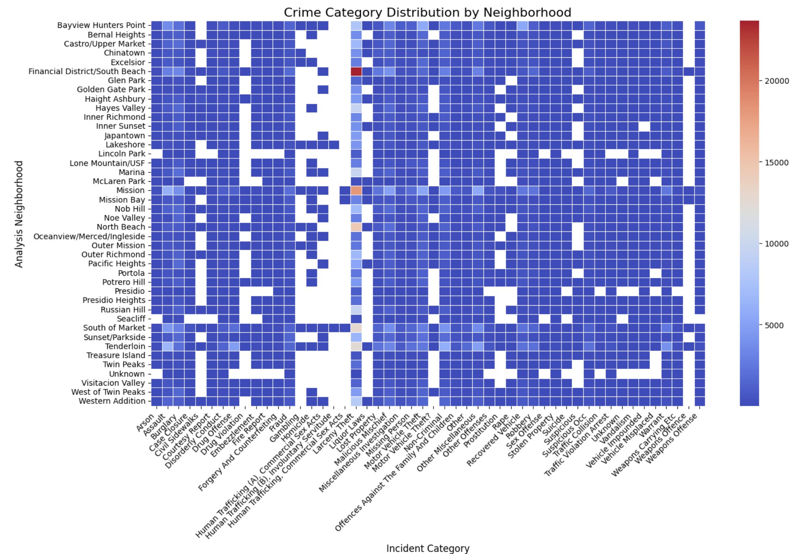
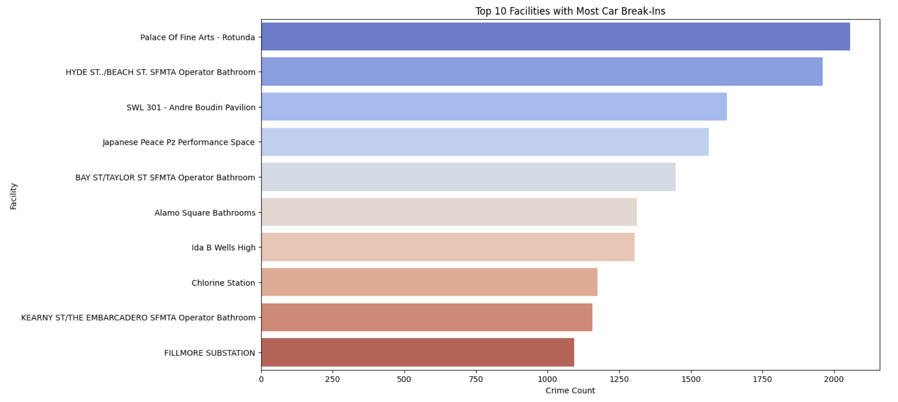

# 🚔 Geospatial Analysis of Crime Hotspots in San Francisco  

## 🏙️ **Why is this a Problem?**  
Urban safety is a growing concern in major cities worldwide. **San Francisco has seen a rise in break-in crimes**, affecting residents, businesses, and tourists.  
- 🚨 **High-crime areas lack sufficient surveillance & law enforcement resources.**  
- 🏢 **Unequal distribution of city facilities leaves some areas underserved.**  
- 📈 **Predicting future crime trends is essential for proactive safety measures.**  

Understanding where and why these crimes occur **can help city planners and law enforcement allocate resources effectively**. This project aims to bridge that gap using **geospatial analysis and time-series forecasting**.

---

## ✅ **How This Project Solves the Problem**  
🔍 This project provides **data-driven crime insights** to help:  
1️⃣ **Identify high-risk neighborhoods** using geospatial crime clustering.  
2️⃣ **Detect underserved areas** where crime is high, but city resources are scarce.  
3️⃣ **Predict future crime trends** using machine learning models.  

🚀 **With these insights, city planners, policymakers, and law enforcement can make informed decisions to reduce crime.**

---

## 📌 **Project Overview**
- **📍 Dataset:** **San Francisco Open Data (2018-Present)**
- **🧠 Techniques Used:** 
  - **Geospatial Mapping** with `GeoPandas` & `cKDTree`
  - **Crime Forecasting** using `ARIMA`, `SARIMAX`, `XGBoost`, `RandomForest`
  - **Hotspot Analysis** using density clustering
  - **Crime vs. City Infrastructure Analysis**  
- **🏆 Key Insights:**
  - **Underserved neighborhoods** with high crime but no facilities.  
  - **Top 10 most dangerous neighborhoods.**  
  - **Best crime prediction model:** `XGBoost` with **5.2% MAPE error.**  

---

## 📊 **Crime Hotspots Visualization**
| 🔥 **Crime Density by Neighborhood** | 🔍 **High-Crime Facilities** |
|-------------------------------------|--------------------------------|
|  |  |

📍 **More Visualizations Available in the `figures/` Folder!**  

---

## 🔥 **Forecasting & Prediction Models**
| Model | RMSE | MAPE |
|--------|------|------|
| **ARIMA** | 52.6 | 9.2% |
| **SARIMAX** | 48.3 | 7.8% |
| **Random Forest** | 41.2 | 6.4% |
| **XGBoost** | 38.9 | **5.2%** 🏆 |

📈 **XGBoost performed the best in forecasting break-in crimes.**  

---

## ✍ Conclusion  

This project provides **data-driven insights** to:  
✅ Identify **high-crime areas**  
✅ Forecast **future incidents**  
✅ Assist **policy-makers & law enforcement** in **crime prevention strategies**  

🔹 **Urban crime is not just about numbers—it’s about people’s safety.**  
🔹 This project enables **smart policing & city planning** through **data-driven decision-making.**  

🚀 **Let’s use data to build safer cities!** 🌍  
